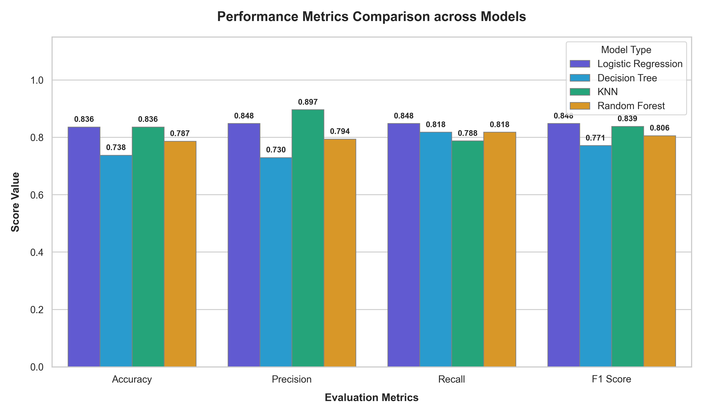
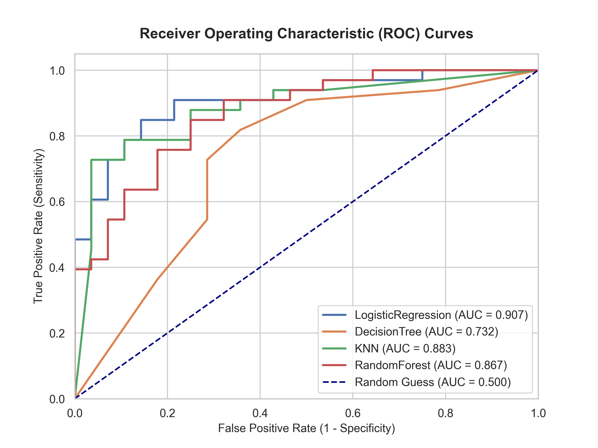
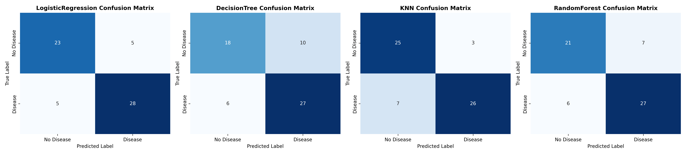
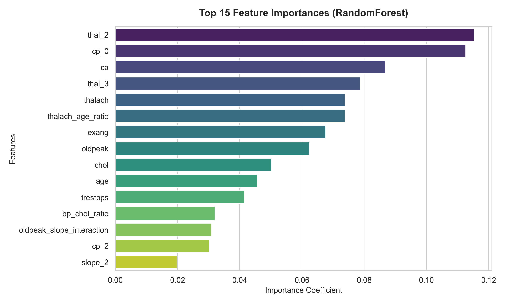

# CORDIS: Cardiovascular Diagnostic Support System

[](https://www.python.org/)
[](https://opensource.org/licenses/MIT)
[]()

**CORDIS** is an end-to-end clinical prognostic support framework designed to predict heart disease risk using cross-validated machine learning techniques. By transforming complex multidimensional clinical covariates—such as ECG features, exercise-induced angina, age, and cholesterol levels—CORDIS helps identify cardiovascular pathologies early.

---

## 🚀 Key Performance Highlights

Evaluated on an independent, stratified test set ($N=61$), **CORDIS** delivers high sensitivity and discriminative reliability. Regularized Logistic Regression emerged as the optimal model for clinical deployment due to its balanced precision/recall, high sensitivity, and interpretability:

| Model Paradigm | Accuracy | Precision | Recall (Sensitivity) | $F_1$ Score | ROC-AUC |
| :--- | :---: | :---: | :---: | :---: | :---: |
| **Logistic Regression ($L_2$)** | **83.61%** | 84.85% | **84.85%** | **84.85%** | **0.9069** |
| **K-Nearest Neighbors (KNN)** | **83.61%** | **89.66%** | 78.79% | 83.87% | 0.8826 |
| **Random Forest Ensemble** | 78.69% | 79.41% | 81.82% | 80.60% | 0.8669 |
| **Decision Tree Classifier** | 73.77% | 72.97% | 81.82% | 77.14% | 0.7316 |

---

## 📂 Repository Structure

```text
CORDIS/
├── Datasets/
│   └── heart.csv                 # Target clinical patient database
├── Images/                       # Generated diagnostic/EDA visualization figures
├── Papers/                       # Academic literature survey source files
├── Report/
│   └── CORDIS_Report.md          # Comprehensive, academic project report
├── Literature_Survey.xlsx        # Tabular spreadsheet of literature survey
├── Code/
│   ├── main.py                   # Main ML training & evaluation execution script
│   ├── run_eda_plots.py          # Script generating patient EDA figures
│   ├── generate_comparison.py    # Script producing performance reports & bar charts
│   ├── requirements.txt          # Python package requirements
│   └── src/                      # Modulated pipeline logic
│       ├── preprocessing.py      # Cleansing, splitting, and robust scaling
│       ├── features.py           # Feature engineering transforms
│       ├── train.py              # GridSearchCV models & hyperparameter configs
│       ├── evaluate.py           # Evaluation metric calculations
│       └── visualize.py          # Seaborn diagnostic heatmaps & ROC plotting
├── README.md                     # This documentation file
└── how_to_run.md                 # Brief script execution instructions
```

---

## 🛠️ Installation and Setup

### 1. Clone & Navigate
```bash
git clone https://github.com/tiyamisu/CORDIS.git
cd CORDIS/Code
```

### 2. Environment Activation
* **Windows (PowerShell):**
  ```powershell
  python -m venv venv
  .\venv\Scripts\Activate.ps1
  ```
* **macOS/Linux:**
  ```bash
  python3 -m venv venv
  source venv/bin/activate
  ```

### 3. Install Dependencies
```bash
pip install -r requirements.txt
```

---

## 📊 Run Guide

### Step 1: Generate Exploratory Data Analysis (EDA)
Creates demographic distributions, target ratios, and correlation heatmaps:
```bash
# Run from the root directory to resolve dataset path correctly
cd ..
python Code/run_eda_plots.py
```
*Outputs are saved under the [Images/](Images/) directory.*

### Step 2: Run ML Training & Grid Search Tuning
Ingests, cleans, splits (stratified 80/20), standardizes, trains, and evaluates classifiers:
```bash
cd Code
python main.py
```
*Outputs final parameters and classification reports to console; saves model performance plots to `Images/`.*

### Step 3: Run Model Metric Comparison
Produces the final formatted table and metric comparative bar charts:
```bash
python generate_comparison.py
```

---

## 🎨 Visualization Showcase

### 1. Model Accuracy & Metric Comparison


### 2. ROC Curves (Receiver Operating Characteristic)


### 3. Confusion Matrices (Model Predictions Distribution)


### 4. Feature Importances (Random Forest)


---

## 🎓 Academic Report
For an in-depth clinical analysis, literature survey of 10 key papers, mathematical formulations of risk loss, and theoretical interpretations, refer to:
* **Academic Study Document:** [Report/CORDIS_Report.md](Report/CORDIS_Report.md)

---

## 🔮 Future Enhancements
* **Explainable AI:** Incorporating SHAP/LIME attribution plots directly into the clinician user interface.
* **Privacy-Preserving Federated Learning:** Implementing secure federated learning nodes to compile insights across hospitals without moving local patient records.
* **Active Learning Loops:** Committee-based label querying systems to iteratively select borderline cases for annotator review.

---

## 📝 License
This project is licensed under the MIT License - see the [LICENSE](LICENSE) file for details.
