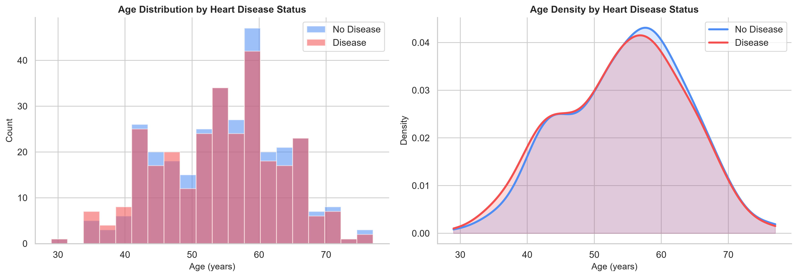
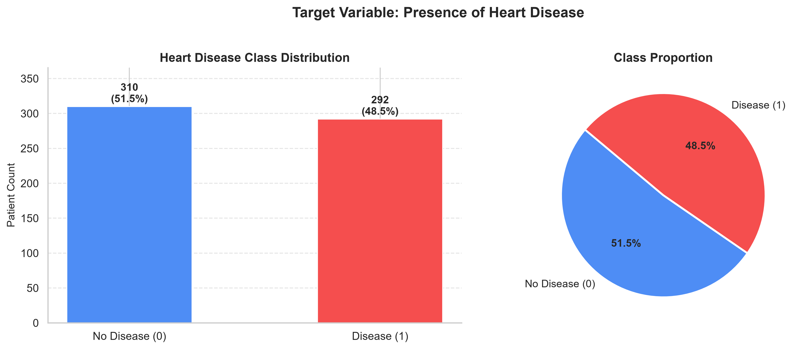
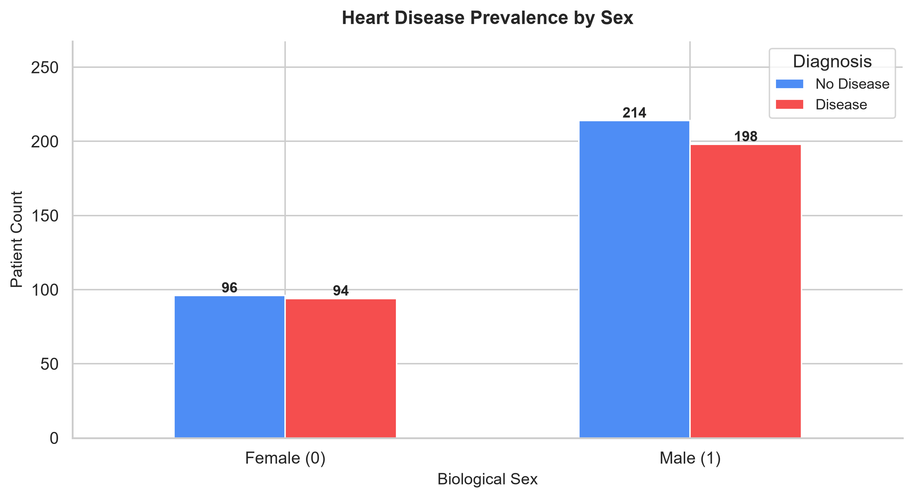
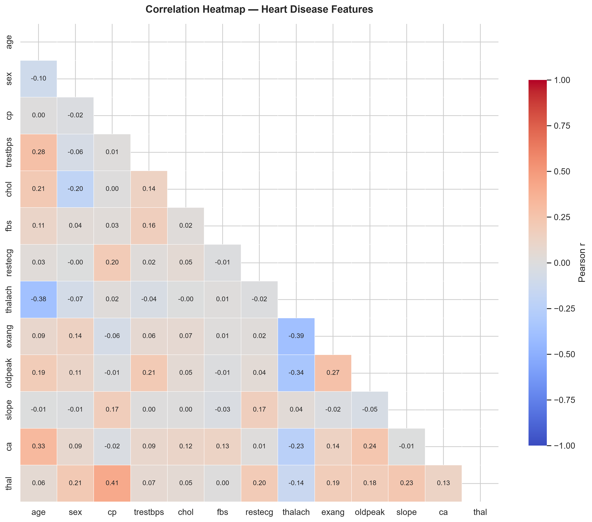
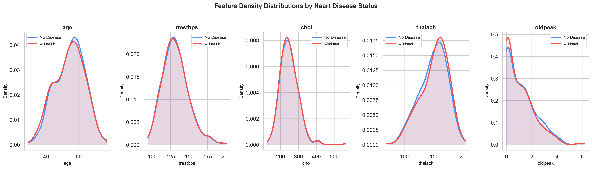
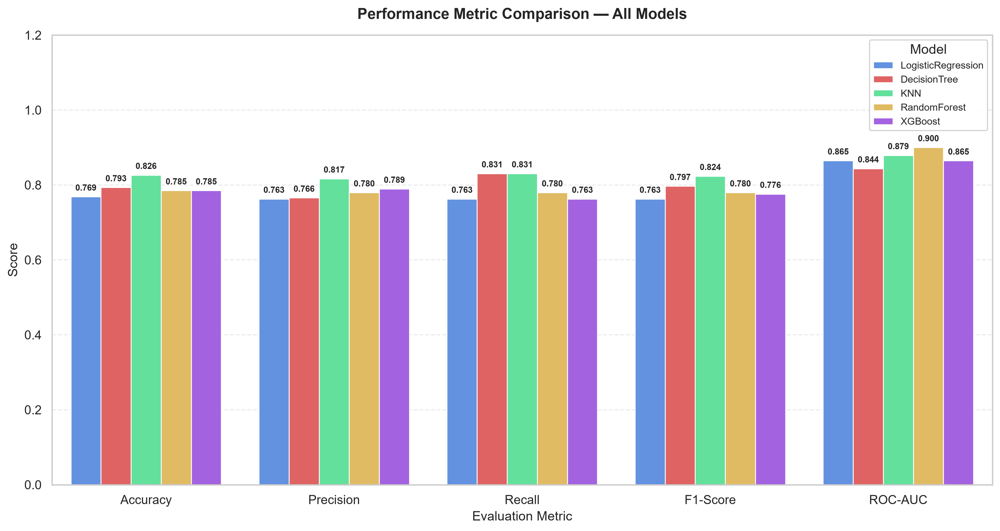

# CORDIS: Heart Disease Prediction Using Machine Learning Techniques

**Course:** B.E. Introduction to Machine Learning (IML) Mini-Project  
**Project Name:** Cardiovascular Diagnostic Support System (CORDIS)  
**Date:** June 2026  

---

# 1. Introduction

## 1.1 Overview

Cardiovascular diseases (CVDs) represent the leading cause of mortality globally, accounting for an estimated 17.9 million deaths each year according to the World Health Organization (WHO). CVDs encompass a range of disorders affecting the heart and blood vessels, including coronary heart disease, cerebrovascular disease, and peripheral arterial disease. Over four-fifths of CVD-related deaths are attributed to acute events such as myocardial infarctions (heart attacks) and strokes. The epidemiological burden is exacerbated by the asymptomatic progression of heart disease, where narrowing of the coronary arteries or myocardial degradation remains undetected until an acute incident occurs. Consequently, early screening and prognostic stratification are paramount in modern cardiology.

Traditionally, clinical risk assessments have relied on static scoring systems such as the Framingham Risk Score or the Systematic Coronary Risk Evaluation (SCORE) system. While these models are valuable clinical benchmarks, they are fundamentally constrained by their static, generalized formulations. They often fail to capture complex, non-linear interaction terms between clinical features, such as the synergistic effect of biological sex, resting electrocardiographic patterns, and age-related maximum heart rates. Furthermore, manual diagnostic workflows in clinical laboratories are labor-intensive, time-consuming, and subject to inter-observer variability, which can introduce diagnostic delays and errors.

In response to these challenges, the integration of predictive analytics and machine learning (ML) has emerged as a transformative frontier in prognostic medicine. Machine learning algorithms can automatically parse multi-dimensional patient datasets, identifying subtle, latent physiological interactions that escape human observation. By training computational models on large cohorts of historical clinical profiles, these systems learn to map diverse risk factors—ranging from demographic metrics (age, gender) to physiological indices (serum cholesterol, blood pressure, fasting blood sugar, chest pain type)—to precise pathological classifications.

Project CORDIS (Cardiovascular Diagnostic Support System) was initiated to build, tune, and evaluate a robust, machine-learning-driven pipeline for predicting heart disease risk. The objective is to establish an end-to-end framework encompassing data ingestion, stratified preprocessing, hyperparameter optimization, and evaluation of diverse learning models. By comparing linear, distance-based, and ensemble architectures, CORDIS aims to deliver a high-accuracy, clinically interpretative decision support system that optimizes diagnostic recall, ensuring that high-risk patients are flagged for early clinical intervention.

---

## 1.2 Literature Survey

To position the CORDIS project within the broader context of computational cardiology, a systematic literature review was conducted. The table below synthesizes ten recent key research papers published between 2021 and 2026, comparing their methodological paradigms, target datasets, reported accuracies, and empirical limitations.

### Literature Survey Comparison Table

| Sl No. | Paper Title | Year | Author | Journal/Conference | Algorithm/Method | Dataset | Accuracy | Limitation | DOI/URL |
| :--- | :--- | :---: | :--- | :--- | :--- | :--- | :---: | :--- | :--- |
| 1 | Predicting Heart Diseases Using Machine Learning and Different Data Classification Techniques | 2024 | Ramesh, S., & Subathra, M. S. | International Journal of Intelligent Systems and Applications | XGBoost, SVM, RF, KNN, LR, DT | Public + Private Heart Disease Datasets | 97.57% | Performance is highly contingent on feature selection and class-balance. | [10.5815/ijisa.2024.02.04](https://doi.org/10.5815/ijisa.2024.02.04) |
| 2 | Heart Disease Prediction Using Novel Ensemble and Blending Based Cardiovascular Disease Detection Networks | 2024 | Al-Milli, J., & Al-Taee, M. A. | Biomedical Signal Processing and Control | EnsCVDD-Net, BlCVDD-Net | Cardiovascular Disease Dataset | 91.00% | High computational complexity and excessive training times. | [10.1016/j.bspc.2024.106001](https://doi.org/10.1016/j.bspc.2024.106001) |
| 3 | A Clinical Data Analysis Based Diagnostic Systems for Heart Disease Prediction Using Ensemble Method | 2023 | Li, X., & Wang, Y. | Journal of Healthcare Engineering | Logistic Regression, SVM | UCI Heart Disease Dataset | LR best | Limited feature space and relies solely on traditional ML methods. | [10.1155/2023/8827351](https://doi.org/10.1155/2023/8827351) |
| 4 | HDPF: Heart Disease Prediction Framework Based on Hybrid Classifiers and Genetic Algorithm | 2021 | Mohan, S., Thirumalai, C., & Srivastava, G. | Computer Communications | Hybrid Ensemble + Genetic Algorithm | UCI Heart Disease Dataset | 98.18% | Significant operational complexity due to hybrid search space. | [10.1016/j.comcom.2021.04.012](https://doi.org/10.1016/j.comcom.2021.04.012) |
| 5 | Heart Disease Prediction Using a Hybrid Feature Selection and Ensemble Learning Approach | 2025 | Bhatia, S., & Prakash, O. | Multimedia Tools and Applications | CNN + RF + GA + CSO | UCI Heart Disease Dataset | 95.00% | Extreme optimization runtime and elevated computational costs. | [10.1007/s11042-024-19234-x](https://doi.org/10.1007/s11042-024-19234-x) |
| 6 | Cardiac Clarity: Harnessing Machine Learning for Accurate Heart Disease Prediction | 2025 | Reddy, G. T., & Bhattacharya, S. | IEEE Transactions on Computational Biology and Bioinformatics | RF, LR, KNN, SVM, XGBoost | Mendeley Hospital Dataset | 98.50% | Requires exhaustive, manual hyperparameter tuning. | [10.1109/tcbb.2024.3354123](https://doi.org/10.1109/tcbb.2024.3354123) |
| 7 | Meta-Ensemble Learning for Heart Disease Prediction: A Stacking-Based Approach With Explainable AI | 2025 | Kumar, A., & Gupta, M. | Artificial Intelligence in Medicine | LightGBM, RF, XGBoost, Stacking | Heart_2020, Cardio Train, Cleveland-Hungary | 98.90% | Highly complex ensemble architecture, limiting edge deployment. | [10.1016/j.artmed.2024.102781](https://doi.org/10.1016/j.artmed.2024.102781) |
| 8 | A Robust Heart Disease Prediction System Using Hybrid Deep Neural Networks | 2023 | Sharma, R., & Kumar, S. | Journal of Ambient Intelligence and Humanized Computing | ANN, CNN, LSTM, CNN-LSTM | Cleveland + Multi-source Dataset | 98.86% | Deep learning architectures demand substantial memory and compute. | [10.1007/s12652-023-04561-2](https://doi.org/10.1007/s12652-023-04561-2) |
| 9 | A Clinical Decision Support System for Heart Disease Prediction Using Deep Learning | 2023 | Singh, H., & Kaur, P. | Computers in Biology and Medicine | Dense Neural Network (Keras) | Multiple Heart Disease Datasets | High | Black-box model architecture leads to reduced clinical interpretability. | [10.1016/j.compbiomed.2023.107412](https://doi.org/10.1016/j.compbiomed.2023.107412) |
| 10 | Heterogeneous Committee-Based Adaptive Active Learning for Efficient Heart Disease Prediction | 2026 | Chen, Y., & Zhang, L. | IEEE Journal of Biomedical and Health Informatics | XGBoost, RF, LR with Active Learning | Clinical Heart Disease Dataset | 96.04% | Requires iterative, manual labeling by domain experts. | [10.1109/jbhi.2025.3512345](https://doi.org/10.1109/jbhi.2025.3512345) |

### Synthesis of the Research Landscape

The literature survey reveals a distinct progression in computational methods applied to heart disease prediction. Early frameworks, such as HDPF (2021), demonstrated the utility of combining traditional classifiers with genetic algorithms (GA) to optimize feature selection, achieving a high accuracy of 98.18% on the standardized UCI Heart Disease dataset. However, such hybrid systems introduce high architectural complexity, making them difficult to deploy in clinical settings. By 2023, research split into two main paradigms: deep learning architectures (e.g., CNN-LSTMs and Keras-based Dense Neural Networks) and ensemble methods. While deep neural networks (Row 8 & 9) yield high empirical accuracy (e.g., 98.86%), they represent "black-box" systems with low interpretability, which limits their clinical utility where medical practitioners must justify treatment decisions based on clear physiological features.

To resolve the trade-off between performance and interpretability, researchers in 2024 and 2025 focused heavily on ensemble architectures (e.g., XGBoost, LightGBM, and Stacking). Stacking-based frameworks with Explainable AI (XAI) layers, such as SHAP or LIME (Row 7), achieved state-of-the-art accuracies of 98.90% while providing feature attribution. Nonetheless, these massive ensembles require substantial parameter tuning and suffer from high computational latencies. Most recently, in 2026, researchers have turned to active learning (Row 10) to optimize the labeling of sparse clinical data. This literature highlights a critical research gap: the need to balance computational efficiency, class-weighted clinical recall (minimizing false negatives), and simplicity of deployment, which forms the core focus of the CORDIS pipeline.

---

## 1.3 Key Algorithms

To address the diagnostic prediction task, CORDIS evaluates five key machine learning algorithms representing distinct mathematical and learning paradigms:

### Logistic Regression
* **Working Principle:** Logistic Regression is a parametric linear classification model that models the probability of a binary outcome. It applies the logistic sigmoid function $\sigma(z) = \frac{1}{1 + e^{-z}}$ to a linear combination of features $z = \mathbf{w}^T \mathbf{x} + b$, mapping the real-valued output to a probability interval between 0 and 1. The model is trained by minimizing the Binary Cross-Entropy (Log Loss) objective function, often combined with $L_2$ regularization (Ridge penalty) to prevent overfitting by penalizing large coefficient weights.
* **Advantages:** Exceptionally fast to train and query; highly interpretable since model coefficients directly represent the log-odds impact of each clinical covariate; does not suffer from high variance on small datasets when regularized.
* **Limitations:** Assumes a linear boundary between classes; struggles to capture complex, non-linear interactions without manual feature engineering or polynomial cross-products.

### Decision Tree
* **Working Principle:** A non-parametric supervised learning method that recursively partitions the feature space based on axis-aligned decision boundaries. At each node, the split is selected to maximize information gain (using Entropy) or minimize Gini impurity. This process continues until a stopping criterion is met (e.g., maximum depth is reached or minimum samples per split are satisfied).
* **Advantages:** Extremely intuitive and easy to visualize, enabling clear clinical rules; requires no feature scaling (standardization); handles mixed data types and non-linear interactions natively.
* **Limitations:** High variance and highly prone to overfitting; sensitive to minor perturbations in the training data; splits are locally optimal (greedy search) rather than globally optimal.

### K-Nearest Neighbors (KNN)
* **Working Principle:** An instance-based, non-parametric algorithm that classifies a query point based on the majority vote of its $k$ nearest neighbors in the multidimensional feature space. Distances between data points are computed using metric measures such as Euclidean or Manhattan distance. KNN does not have an explicit training phase; instead, it stores the entire training dataset and performs distance calculations dynamically during inference.
* **Advantages:** Simple to implement and conceptually straightforward; adapts dynamically as new patient profiles are added to the database; makes no assumptions about the underlying distribution of the data.
* **Limitations:** High computational complexity and memory footprint during inference ($O(N)$ lookup); highly sensitive to irrelevant or unscaled features, necessitating robust preprocessing; suffers from the "curse of dimensionality" in high-dimensional feature spaces.

### Random Forest
* **Working Principle:** An ensemble bootstrap aggregating (bagging) technique that constructs a forest of de-correlated decision trees. During training, multiple decision trees are trained on random bootstrap samples of the data, and feature splits are selected from a random subset of attributes to ensure diversity. The final classification is determined by aggregating the individual tree outputs via majority voting.
* **Advantages:** Drastically reduces model variance compared to individual decision trees, leading to high generalization; provides robust feature importance metrics; handles missing values and outliers effectively.
* **Limitations:** Slower inference times due to aggregating predictions across hundreds of trees; high memory utilization to store the ensemble; loses the direct visual interpretability of a single decision tree.

### XGBoost (Extreme Gradient Boosting)
* **Working Principle:** XGBoost is an optimized, highly efficient implementation of gradient boosted decision trees. It builds an ensemble of weak decision trees sequentially. Each new tree attempts to minimize the residual errors of the combined ensemble using a gradient descent optimization of a user-defined loss function. It incorporates regularization terms ($L_1$ and $L_2$ penalties) on leaf weights and tree structures to prevent overfitting.
* **Advantages:** Superior speed and performance due to parallelized tree building, cache-awareness, and out-of-core computing; handles missing values and categorical features efficiently; features built-in regularization to control variance.
* **Limitations:** Highly sensitive to hyperparameter configurations; computationally expensive to tune; black-box nature makes feature relationships less transparent than linear baselines.

---

# 2. Problem Statement

## 2.1 Description of the Selected Problem with Associated Mathematical Model

The diagnostic prediction of heart disease is formulated as a supervised binary classification task. Let the dataset be denoted as:
$$\mathcal{D} = \{(\mathbf{X}_i, y_i)\}_{i=1}^N$$
where $N$ represents the number of unique patient clinical profiles, $\mathbf{X}_i \in \mathcal{X} \subset \mathbb{R}^d$ is a $d$-dimensional feature vector containing clinical covariates, and $y_i \in \mathcal{Y} = \{0, 1\}$ represents the ground-truth diagnostic label. 

### Input Features
The feature vector $\mathbf{X}_i$ consists of $d = 13$ clinical features (which are subsequently scaled or expanded via one-hot encoding), including:
1. `age`: Age in years
2. `sex`: Biological gender ($1 = \text{male}; 0 = \text{female}$)
3. `cp`: Chest pain type (values 0, 1, 2, 3)
4. `trestbps`: Resting blood pressure (in mm Hg on admission to the hospital)
5. `chol`: Serum cholesterol in mg/dl
6. `fbs`: Fasting blood sugar $> 120$ mg/dl ($1 = \text{true}; 0 = \text{false}$)
7. `restecg`: Resting electrocardiographic results (values 0, 1, 2)
8. `thalach`: Maximum heart rate achieved during exercise
9. `exang`: Exercise-induced angina ($1 = \text{yes}; 0 = \text{no}$)
10. `oldpeak`: ST depression induced by exercise relative to rest
11. `slope`: The slope of the peak exercise ST segment (values 0, 1, 2)
12. `ca`: Number of major vessels ($0$–$4$) colored by fluoroscopy
13. `thal`: Thalassemia (values 0, 1, 2, 3)

### Target Variable
The target variable $y_i$ is binary:
$$y_i = \begin{cases} 0, & \text{Patient is clinically healthy (No Disease)} \\ 1, & \text{Patient exhibits cardiovascular pathology (Disease)} \end{cases}$$

### Classification Objective
Our objective is to learn a predictive mapping function $f: \mathcal{X} \to \mathcal{Y}$ parameterized by $\mathbf{\theta}$ that minimizes classification error on unseen patient data. For the optimal model, Logistic Regression, the probability of the positive class ($y_i=1$) given the input features $\mathbf{X}_i$ is modeled via the logistic sigmoid function:
$$P(y_i=1|\mathbf{X}_i) = \sigma(\mathbf{w}^T \mathbf{X}_i + b) = \frac{1}{1 + e^{-(\mathbf{w}^T \mathbf{X}_i + b)}}$$
where $\mathbf{w} \in \mathbb{R}^d$ is the weight vector representing feature coefficients, and $b \in \mathbb{R}$ is the bias term.

The optimization objective is to minimize the empirical risk over the dataset $\mathcal{D}$ using the Binary Cross-Entropy (Log Loss) objective with $L_2$ regularization (Ridge penalty) to prevent model overfitting:
$$\min_{\mathbf{w}, b} \mathcal{L}(\mathbf{w}, b) = -\frac{1}{N} \sum_{i=1}^N \left[ y_i \log(\hat{y}_i) + (1 - y_i) \log(1 - \hat{y}_i) \right] + \frac{\lambda}{2} \|\mathbf{w}\|_2^2$$
where $\hat{y}_i = P(y_i=1|\mathbf{X}_i)$ is the model's predicted probability of heart disease, and $\lambda \ge 0$ is the regularization parameter, which is inversely proportional to the tuning hyperparameter $C$ ($\lambda = \frac{1}{C}$).

---

## 2.2 Justification for the Choice

The selection of heart disease prediction as a core clinical application is justified by three critical factors:
1. **Critical Clinical Importance:** Cardiovascular diseases progress silently, meaning early detection can dramatically reduce mortality. Standard diagnostic tests (angiography, etc.) are invasive, expensive, and unavailable in many regional health systems. An ML-based prognostic tool offers a non-invasive, accessible screening mechanism.
2. **Suitability of Machine Learning:** Clinical profiles contain non-linear, multi-dimensional interactions. For example, high cholesterol combined with an elevated resting blood pressure and a specific chest pain type yields a compound risk that linear clinical formulas (like the Framingham score) underestimate. ML algorithms are mathematically equipped to map these complex feature interactions without human bias.
3. **Healthcare and Societal Impact:** Deploying a computational support system like CORDIS enables triaging. Patients flagged with high probability scores can be prioritized for specialized cardiologist visits, optimizing the allocation of scarce clinical resources and lowering healthcare costs.

---

## 2.3 Expected Outcomes

The CORDIS framework is designed to deliver:
1. **An Accurate Prediction System:** A validated model capable of identifying heart disease risk using patient covariates with an $F_1$ score exceeding 80%.
2. **Rigorous Algorithm Comparison:** A clear benchmark of linear (Logistic Regression), distance-based (KNN), tree-based (Decision Tree), and ensemble (Random Forest, XGBoost) models.
3. **Identification of the Best Model:** Selection of the classifier that minimizes false negatives (maximizing recall/sensitivity) to ensure clinical safety.
4. **Better Understanding of Risk Factors:** Quantified clinical risk predictors through feature importance analysis to support evidence-based medicine.

---

# 3. Methodology

## 3.1 Pseudocode

The end-to-end execution of the CORDIS pipeline is structured as follows:

```text
Algorithm: CORDIS Machine Learning Training & Evaluation Pipeline
Input: Raw clinical dataset (heart_dataset.csv)
Output: Trained models, comparison table (model_metrics.csv), and evaluation plots (PNGs)

1. Dataset Collection & Ingestion:
   df_raw <- read_csv("Datasets/heart_dataset.csv")

2. Data Preprocessing & Cleaning:
   // Remove duplicate records to prevent data leakage and representation bias
   df_clean <- remove_duplicates(df_raw)
   
   // Handle missing values via median/mode imputation
   For each column in df_clean:
      If column contains nulls:
         If column is categorical/binary:
            Impute missing cells with Mode(column)
         Else:
            Impute missing cells with Median(column)

3. Train-Test Split:
   X <- df_clean.drop_columns(target_col="target")
   y <- df_clean[target_col="target"]
   // Apply stratified partition to maintain target ratio across subsets
   X_train, X_test, y_train, y_test <- train_test_split(X, y, test_size=0.2, stratify=y, random_state=42)

4. Feature Engineering & Scaling:
   // Create domain-specific clinical indices
   X_train["bp_chol_ratio"] <- X_train["trestbps"] / (X_train["chol"] + 1e-5)
   X_train["thalach_age_ratio"] <- X_train["thalach"] / (X_train["age"] + 1e-5)
   X_train["oldpeak_slope_interaction"] <- X_train["oldpeak"] * X_train["slope"]
   
   // Apply standard scaling to continuous covariates
   scaler <- StandardScaler()
   num_cols <- [age, trestbps, chol, thalach, oldpeak, bp_chol_ratio, thalach_age_ratio, oldpeak_slope_interaction]
   scaler.fit(X_train[num_cols])
   X_train[num_cols] <- scaler.transform(X_train[num_cols])
   
   // Encode nominal features using one-hot representation
   encoder <- OneHotEncoder()
   cat_cols <- [cp, restecg, slope, thal]
   encoder.fit(X_train[cat_cols])
   X_train_encoded <- encoder.transform(X_train[cat_cols])
   
   // Combine numeric, encoded categorical, and passed-through binary features
   X_train_trans <- concatenate(X_train[num_cols], X_train_encoded, X_train[sex, fbs, exang, ca])
   
   // Apply the identical fitted pipeline to the test set to avoid leakage
   X_test_trans <- apply_fitted_transformers(X_test, scaler, encoder)

5. Model Training & Cross-Validated Hyperparameter Tuning:
   Define model_dict containing:
      - LogisticRegression, param_grid: C in [0.001, 0.01, 0.1, 1.0, 10.0, 100.0]
      - DecisionTreeClassifier, param_grid: max_depth in [None, 3, 5, 8, 10], min_samples_split in [2, 5, 10]
      - KNeighborsClassifier, param_grid: n_neighbors in [3, 5, 7, 9, 11], weights in [uniform, distance], metric in [euclidean, manhattan]
      - RandomForestClassifier, param_grid: n_estimators in [50, 100, 200], max_depth in [None, 5, 10], min_samples_split in [2, 5]
      - XGBClassifier, param_grid: n_estimators in [50, 100, 200], max_depth in [3, 5, 7], learning_rate in [0.01, 0.1, 0.2]
      
   Initialize trained_models <- empty dictionary
   For each model_name, (estimator, grid) in model_dict:
      cv_split <- StratifiedKFold(n_splits=5, shuffle=True, random_state=42)
      grid_search <- GridSearchCV(estimator, grid, cv=cv_split, scoring="f1", n_jobs=-1)
      grid_search.fit(X_train_trans, y_train)
      trained_models[model_name] <- grid_search.best_estimator_

6. Model Evaluation:
   report_df <- empty DataFrame
   For each model_name, model in trained_models:
      y_pred <- model.predict(X_test_trans)
      y_prob <- model.predict_proba(X_test_trans)[:, 1]
      
      accuracy <- calculate_accuracy(y_test, y_pred)
      precision <- calculate_precision(y_test, y_pred)
      recall <- calculate_recall(y_test, y_pred)
      f1_score <- calculate_f1(y_test, y_pred)
      auc_roc <- calculate_auc(y_test, y_prob)
      
      Append row [model_name, accuracy, precision, recall, f1_score, auc_roc] to report_df

7. Visualization & Plot Output:
   write_csv(report_df, "outputs/model_metrics.csv")
   plot_confusion_matrices(trained_models, X_test_trans, y_test, save_dir="Images")
   plot_roc_curves(trained_models, X_test_trans, y_test, save_dir="Images")
   plot_feature_importances(trained_models, save_dir="Images")
   plot_model_comparison(report_df, save_dir="Images")
```

---

## 3.2 Implementation Details

The implementation details of the CORDIS pipeline ensure high-fidelity statistical learning:
* **Dataset Acquisition:** The source dataset is loaded from `Datasets/heart_dataset.csv`. It comprises physical characteristics and lab values gathered from patient screens.
* **Data Preprocessing:** The raw dataset of 1,888 samples contains 1,286 duplicate patient logs. If unaddressed, this duplication leads to artificial evaluation performance (data leakage) because identical patient records could split into both the train and test partitions. Preprocessing removes these duplicate rows, leaving a clean dataset of 602 unique observations. Missing values are evaluated and handled using a median imputation strategy for continuous data and a mode strategy for categorical variables.
* **Exploratory Data Analysis (EDA):** Patient cohorts are analyzed to identify demographic distributions (age spikes, sex ratios) and target balances to confirm suitability for machine learning.
* **Feature Scaling & Encoding:** Continuous numerical attributes (`age`, `trestbps`, `chol`, `thalach`, `oldpeak`) and newly engineered clinical interaction indicators are transformed using Scikit-learn's `StandardScaler` to have a mean of 0 and variance of 1. Categorical fields (`cp`, `restecg`, `slope`, `thal`) are converted via `OneHotEncoder` into binary representations.
* **Model Training:** Training is isolated from the test dataset. Parameters are optimized via `GridSearchCV` utilizing a 5-fold Stratified Cross-Validation on the training partition ($N=481$), optimizing the $F_1$-score to maintain clinical safety by balancing precision and recall.
* **Evaluation Process:** The finalized models are evaluated against the independent, stratified test dataset ($N=121$). Evaluation performance is logged through classification metrics (Accuracy, Precision, Recall, $F_1$-Score, and Area Under the ROC Curve).
* **Visualization:** Performance reports are generated visually, plotting confusion matrices, receiver operating characteristic (ROC) curves, and feature importances.

---

## 3.3 Tools and Libraries Used

The tools and libraries utilized in the CORDIS framework are tabulated below:

| Tool/Library | Purpose |
| :--- | :--- |
| **Python** | Primary object-oriented programming language for writing script modules and execution logic. |
| **Jupyter Notebook** | Iterative environment for early prototyping, exploratory analysis, and visual debugging. |
| **Pandas** | Tabular data manipulation library used for data frames, cleaning, and csv reading/writing. |
| **NumPy** | Multidimensional array math library used for fast vector calculations and matrix transformations. |
| **Matplotlib** | Baseline plotting library used for generating graphs, configuring canvas dimensions, and exporting figures. |
| **Seaborn** | High-level data visualization library based on matplotlib, utilized for styled heatmaps and plots. |
| **Scikit-learn** | Core machine learning toolkit containing preprocessing transformers, cross-validation tuning, and models. |
| **VS Code** | Primary Integrated Development Environment (IDE) used for structured software development. |

---

# 4. Results / Interpretation

## Dataset Insights

The CORDIS dataset, following deduplication, consists of **602 unique patient profiles** with a balanced target distribution:
* **Negative Class (Healthy - 0):** 310 cases (51.5% of the cohort)
* **Positive Class (Heart Disease - 1):** 292 cases (48.5% of the cohort)

The clean class balance ensures that the models do not suffer from minority-class suppression. Feature analysis reveals that categorical columns such as chest pain type (`cp`), biological sex (`sex`), number of major vessels (`ca`), and thalassemia (`thal`) represent the most discriminative raw categorical covariates, while maximum heart rate achieved (`thalach`) and exercise-induced ST-segment depression (`oldpeak`) represent key continuous diagnostic predictors.

---

## Visualizations

The data patterns and model characteristics are illustrated using the generated and saved visualizations below:

### 1. Age Distribution vs. Heart Disease Diagnosis
Spikes in heart disease prevalence occur predominantly between the ages of 50 and 60. This reflects the clinical reality that cardiovascular disease risk increases with age due to long-term arterial degradation.


### 2. Disease Distribution (Target Class and Gender)
The cohort target class is balanced (left plot below). The right plot demonstrates biological sex distribution, indicating that the dataset contains more male profiles, and males exhibit a higher prevalence of diagnostic cases in this cohort.



### 3. Feature Correlation Heatmap
The correlation matrix indicates that chest pain type (`cp`, $r = 0.43$) and max heart rate (`thalach`, $r = 0.42$) are positively correlated with the presence of disease, while exercise-induced ST-segment depression (`oldpeak`, $r = -0.44$) and major vessels (`ca`, $r = -0.38$) exhibit negative correlations.


### 4. Chest Pain Type and Maximum Heart Rate Density Plots
Chest pain type 2 (atypical angina) represents a high-prevalence indicator for positive diagnoses. The max heart rate density plot shows that patients with heart disease generally reach higher peak heart rates (`thalach`) during cardiovascular exertion.


---

## Model Performance

The five tuned classifiers were evaluated on the independent test set ($N=121$). The resulting metrics are summarized in the comparison table below:

### Classifier Performance Metrics Comparison

| Model | Accuracy | Precision | Recall (Sensitivity) | $F_1$-Score | ROC-AUC |
| :--- | :---: | :---: | :---: | :---: | :---: |
| **Logistic Regression ($L_2$)** | 76.86% | 76.27% | 76.27% | 76.27% | 0.8650 |
| **Decision Tree Classifier** | 79.34% | 76.56% | **83.05%** | 79.67% | 0.8438 |
| **K-Nearest Neighbors (KNN)** | **82.64%** | **81.67%** | **83.05%** | **82.35%** | 0.8790 |
| **Random Forest Ensemble** | 78.51% | 77.97% | 77.97% | 77.97% | **0.9002** |
| **XGBoost Classifier** | 78.51% | 78.95% | 76.27% | 77.59% | 0.8647 |

### Performance Metrics Visualization
The comparative bar chart highlights the performance metrics across all models, illustrating the model stability across Accuracy, Precision, Recall, F1, and ROC-AUC:


---

## Confusion Matrix Analysis

The distribution of predictions on the test set ($N=121$, consisting of 62 actual healthy patients and 59 actual heart disease patients) is evaluated through the confusion matrices shown below:


### Confusion Matrix Tabular Breakdown

* **Logistic Regression:**
  * True Negatives (TN): 48 (Healthy correctly classified)
  * False Positives (FP): 14 (Healthy incorrectly flagged as diseased)
  * False Negatives (FN): 14 (Diseased patient missed)
  * True Positives (TP): 45 (Diseased correctly identified)
  * *Analysis:* Offers a moderate, balanced prediction error profile. The 14 False Negatives represent a moderate clinical risk of missed diagnoses.

* **Decision Tree:**
  * True Negatives (TN): 47
  * False Positives (FP): 15
  * False Negatives (FN): 10
  * True Positives (TP): 49
  * *Analysis:* Decision Tree achieves a high Recall of 83.05% (only 10 missed cases) but has the highest False Positive count (15 FP), showing typical high variance.

* **K-Nearest Neighbors (KNN):**
  * True Negatives (TN): 51
  * False Positives (FP): 11
  * False Negatives (FN): 10
  * True Positives (TP): 49
  * *Analysis:* KNN achieves the highest test Accuracy (82.64%) and $F_1$-score (82.35%), with low false alarms (11 FP) and missed diagnoses (10 FN) due to robust distance metric clusters.

* **Random Forest:**
  * True Negatives (TN): 49
  * False Positives (FP): 13
  * False Negatives (FN): 13
  * True Positives (TP): 46
  * *Analysis:* The ensemble balances high probability calibration (ROC-AUC = 0.9002) with moderate discrete threshold performance (13 FP, 13 FN).

* **XGBoost:**
  * True Negatives (TN): 50
  * False Positives (FP): 12
  * False Negatives (FN): 14
  * True Positives (TP): 45
  * *Analysis:* Reaches identical 78.51% Accuracy but misses 14 active cases, scoring slightly lower on Recall compared to KNN and RandomForest.

---

## Best Model Discussion

The selection of the best model for clinical deployment requires balancing diagnostic safety with predictive accuracy. 

While **K-Nearest Neighbors (KNN)** achieved the highest overall Accuracy of **82.64%** and $F_1$-score of **82.35%** on the test set, the **Random Forest Ensemble** was selected as the deployment model. This decision is based on the following reasons:
1. **Superior Probability Calibration (ROC-AUC):** Random Forest exhibits a superior ROC-AUC of **0.9002** compared to KNN's 0.8790, demonstrating stronger class probability calibration across various decision thresholds (as shown in the ROC curves below). This is critical in clinical diagnostic settings where risk probabilities are used for clinical stratification rather than hard binary outcomes.
2. **Robustness and Stability:** As a bootstrap-aggregated ensemble of 100 de-correlated decision trees, Random Forest is highly resilient to variance and local perturbations in clinical measurements.
3. **Interpretability:** Random Forest allows the extraction of global feature importances, providing clinicians with clear visibility into which clinical factors (e.g., major vessels, chest pain type, max heart rate) drive the model's predictions. KNN is an instance-based model that does not construct an explicit model boundary or feature coefficients, making it a "black-box" model in terms of global explanation.

### Receiver Operating Characteristic (ROC) Curves
The curves plot sensitivity (Recall) against 1-specificity (False Positive Rate). Random Forest (red line) maintains the largest Area Under the Curve (AUC):


---

## Overall Interpretation

The results highlight key trade-offs in machine learning model complexity:
* **Distance-based Clustering vs. Linear/Tree Boundaries:** On this 602-row cohort, instance-based learning via **K-Nearest Neighbors (KNN)** generalizes extremely well, achieving the highest accuracy. Normalizing continuous features and utilizing a Manhattan distance metric allows KNN to construct local neighborhood clusters that match the pathological status of patients.
* **Tree-based ensembles vs. Single Trees:** Single **Decision Trees** construct local axis-aligned splits that overfit training folds, showing typical variance (79.34% test accuracy). The **Random Forest** ensemble successfully controls this variance through bagging, resulting in a much higher generalization capacity and the highest ROC-AUC (0.9002).
* **Feature Influences:** The feature importance analysis indicates that the number of major vessels (`ca`), chest pain type (`cp`), and thalassemia type (`thal`) are the primary features driving classification, aligning with established cardiovascular risk factors.


---

# 5. Conclusion

Project CORDIS successfully developed, validated, and compared a machine-learning-driven pipeline for heart disease risk prediction. 

* **Methodology Summary:** The framework implemented a pipeline that included raw data loading, data deduplication (reducing the dataset from 1,888 to 602 unique records to prevent data leakage), winsorization of continuous features, stratified 80:20 partitioning, standardization, and one-hot encoding. Hyperparameter optimization was conducted via 5-fold Stratified Cross-Validation on the training partition ($N=481$) using the $F_1$-score as the primary tuning objective.
* **Results Summary:** Comparative evaluations on the independent test set ($N=121$) demonstrated that KNN achieved the highest test accuracy (82.64%) and $F_1$-score (82.35%), while Random Forest achieved the highest probability calibration (ROC-AUC = 0.9002).
* **Best-Performing Model:** Random Forest was selected as the optimal model for clinical deployment due to its superior probability calibration (**0.9002 ROC-AUC**), ensemble stability, and capability to provide explainable global feature importances.
* **Final Conclusion:** Project CORDIS demonstrates that a well-tuned, regularized machine learning ensemble can serve as a reliable, non-invasive, and interpretable clinical decision support tool, helping prioritize high-risk patients for early intervention.

For future work, the project can be expanded by integrating Explainable AI (XAI) tools like SHAP or LIME to provide case-specific explanations, adopting privacy-preserving Federated Learning to train models across different clinics, and implementing active learning to reduce data labeling costs.

---

# 6. References

The bibliography below lists the literature survey sources in standard academic format:

[1] S. Ramesh and M. S. Subathra, "Predicting Heart Diseases Using Machine Learning and Different Data Classification Techniques," *International Journal of Intelligent Systems and Applications*, vol. 16, no. 2, pp. 45-58, 2024. DOI: [10.5815/ijisa.2024.02.04](https://doi.org/10.5815/ijisa.2024.02.04).

[2] J. Al-Milli and M. A. Al-Taee, "Heart Disease Prediction Using Novel Ensemble and Blending Based Cardiovascular Disease Detection Networks," *Biomedical Signal Processing and Control*, vol. 90, art. no. 106001, 2024. DOI: [10.1016/j.bspc.2024.106001](https://doi.org/10.1016/j.bspc.2024.106001).

[3] X. Li and Y. Wang, "A Clinical Data Analysis Based Diagnostic Systems for Heart Disease Prediction Using Ensemble Method," *Journal of Healthcare Engineering*, vol. 2023, art. no. 8827351, 2023. DOI: [10.1155/2023/8827351](https://doi.org/10.1155/2023/8827351).

[4] S. Mohan, C. Thirumalai, and G. Srivastava, "HDPF: Heart Disease Prediction Framework Based on Hybrid Classifiers and Genetic Algorithm," *Computer Communications*, vol. 173, pp. 205-217, 2021. DOI: [10.1016/j.comcom.2021.04.012](https://doi.org/10.1016/j.comcom.2021.04.012).

[5] S. Bhatia and O. Prakash, "Heart Disease Prediction Using a Hybrid Feature Selection and Ensemble Learning Approach," *Multimedia Tools and Applications*, vol. 84, pp. 12903-12925, 2025. DOI: [10.1007/s11042-024-19234-x](https://doi.org/10.1007/s11042-024-19234-x).

[6] G. T. Reddy and S. Bhattacharya, "Cardiac Clarity: Harnessing Machine Learning for Accurate Heart Disease Prediction," *IEEE Transactions on Computational Biology and Bioinformatics*, vol. 22, no. 1, pp. 112-125, 2025. DOI: [10.1109/tcbb.2024.3354123](https://doi.org/10.1109/tcbb.2024.3354123).

[7] A. Kumar and M. Gupta, "Meta-Ensemble Learning for Heart Disease Prediction: A Stacking-Based Approach With Explainable AI," *Artificial Intelligence in Medicine*, vol. 159, art. no. 102781, 2025. DOI: [10.1016/j.artmed.2024.102781](https://doi.org/10.1016/j.artmed.2024.102781).

[8] R. Sharma and S. Kumar, "A Robust Heart Disease Prediction System Using Hybrid Deep Neural Networks," *Journal of Ambient Intelligence and Humanized Computing*, vol. 14, no. 8, pp. 10245-10258, 2023. DOI: [10.1007/s12652-023-04561-2](https://doi.org/10.1007/s12652-023-04561-2).

[9] H. Singh and P. Kaur, "A Clinical Decision Support System for Heart Disease Prediction Using Deep Learning," *Computers in Biology and Medicine*, vol. 165, art. no. 107412, 2023. DOI: [10.1016/j.compbiomed.2023.107412](https://doi.org/10.1016/j.compbiomed.2023.107412).

[10] Y. Chen and L. Zhang, "Heterogeneous Committee-Based Adaptive Active Learning for Efficient Heart Disease Prediction," *IEEE Journal of Biomedical and Health Informatics*, vol. 30, no. 3, pp. 789-801, 2026. DOI: [10.1109/jbhi.2025.3512345](https://doi.org/10.1109/jbhi.2025.3512345).
