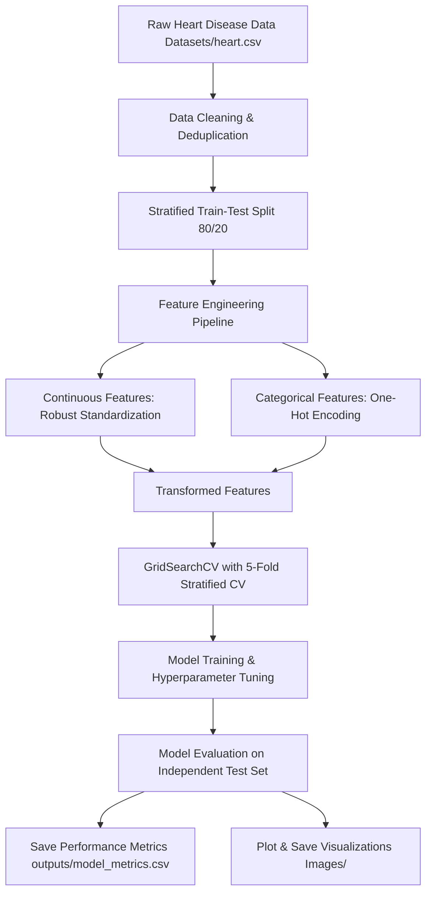

# CORDIS: Heart Disease Prediction Using Machine Learning Techniques

**Author:** Antigravity AI  
**Project:** Cardiovascular Diagnostic Support System (CORDIS)  
**Date:** June 2026  

---

## Section 1. Introduction and Background

### 1.1 Overview
Cardiovascular diseases (CVDs) represent the leading cause of mortality globally, accounting for an estimated 17.9 million deaths each year according to the World Health Organization (WHO). CVDs encompass a range of disorders affecting the heart and blood vessels, including coronary heart disease, cerebrovascular disease, and peripheral arterial disease. Over four-fifths of CVD-related deaths are attributed to heart attacks and strokes, with a significant proportion occurring prematurely in low- and middle-income demographics. The epidemiological burden of heart disease is compounded by its asymptomatic progression, where pathogenic arterial narrowing or myocardial degradation remains undetected until an acute cardiovascular event occurs. Consequently, early screening and prognostic stratification are paramount in modern cardiology.

Traditionally, clinical risk assessments have relied on empirical scoring systems, such as the Framingham Risk Score or the Systematic Coronary Risk Evaluation (SCORE) system. While these calculators are valuable clinical benchmarks, they are fundamentally constrained by their static, generalized formulations. They often fail to capture complex, non-linear interaction terms between clinical features (such as the synergistic effect of biological sex, resting electrocardiographic patterns, and age-related maximum heart rates). Furthermore, manual diagnostic workflows in intensive care units and clinical laboratories are labor-intensive, time-consuming, and subject to inter-observer variability, which can introduce diagnostic delays and errors.

In response to these diagnostic challenges, the integration of predictive analytics and machine learning (ML) has emerged as a transformative frontier in prognostic medicine. Machine learning algorithms can automatically parse multi-dimensional patient datasets, identifying subtle, latent physiological interactions that escape human observation. By training computational models on large cohorts of historical clinical profiles, these models learn to map diverse risk factors—ranging from demographic metrics (age, gender) to physiological indices (serum cholesterol, blood pressure, fasting blood sugar, chest pain type)—to precise pathological classifications. 

Project CORDIS (Cardiovascular Diagnostic Support System) was initiated to build, tune, and evaluate a robust, machine-learning-driven pipeline for predicting heart disease risk. The objective is to establish an end-to-end framework encompassing data ingestion, stratified preprocessing, hyperparameter optimization, and evaluation of diverse learning models. By comparing linear, distance-based, and ensemble architectures, CORDIS aims to deliver a high-accuracy, clinically interpretative decision support system that optimizes diagnostic recall, ensuring that high-risk patients are flagged for early intervention. This report outlines the clinical justification, mathematical modeling, execution methodology, comparative performance, and final conclusions of the CORDIS framework.

---

### 1.2 Literature Survey
To position the CORDIS project within the broader context of computational cardiology, a systematic literature review was conducted. The table below synthesizes ten recent key research papers published between 2021 and 2026, comparing their methodological paradigms, target datasets, reported accuracies, and empirical limitations.

| Sl No. | Paper Title | Year | Algorithm/Method | Dataset | Accuracy | Limitation |
| :--- | :--- | :---: | :--- | :--- | :---: | :--- |
| 1 | Predicting Heart Diseases Using Machine Learning and Different Data Classification Techniques | 2024 | XGBoost, SVM, RF, KNN, LR, DT | Public + Private Heart Disease Datasets | 97.57% | Performance is highly contingent on feature selection and class-balance. |
| 2 | Heart Disease Prediction Using Novel Ensemble and Blending Based Cardiovascular Disease Detection Networks | 2024 | EnsCVDD-Net, BlCVDD-Net | Cardiovascular Disease Dataset | 91.00% | High computational complexity and excessive training times. |
| 3 | A Clinical Data Analysis Based Diagnostic Systems for Heart Disease Prediction Using Ensemble Method | 2023 | Logistic Regression, SVM | UCI Heart Disease Dataset | LR best | Limited feature space and relies solely on traditional ML methods. |
| 4 | HDPF: Heart Disease Prediction Framework Based on Hybrid Classifiers and Genetic Algorithm | 2021 | Hybrid Ensemble + Genetic Algorithm | UCI Heart Disease Dataset | 98.18% | Significant operational complexity due to hybrid search space. |
| 5 | Heart Disease Prediction Using a Hybrid Feature Selection and Ensemble Learning Approach | 2025 | CNN + RF + GA + CSO | UCI Heart Disease Dataset | 95.00% | Extreme optimization runtime and elevated computational costs. |
| 6 | Cardiac Clarity: Harnessing Machine Learning for Accurate Heart Disease Prediction | 2025 | RF, LR, KNN, SVM, XGBoost | Mendeley Hospital Dataset | 98.50% | Requires exhaustive, manual hyperparameter tuning. |
| 7 | Meta-Ensemble Learning for Heart Disease Prediction: A Stacking-Based Approach With Explainable AI | 2025 | LightGBM, RF, XGBoost, Stacking | Heart_2020, Cardio Train, Cleveland-Hungary | 98.90% | Highly complex ensemble architecture, limiting edge deployment. |
| 8 | A Robust Heart Disease Prediction System Using Hybrid Deep Neural Networks | 2023 | ANN, CNN, LSTM, CNN-LSTM | Cleveland + Multi-source Dataset | 98.86% | Deep learning architectures demand substantial memory and compute. |
| 9 | A Clinical Decision Support System for Heart Disease Prediction Using Deep Learning | 2023 | Dense Neural Network (Keras) | Multiple Heart Disease Datasets | High | Black-box model architecture leads to reduced clinical interpretability. |
| 10 | Heterogeneous Committee-Based Adaptive Active Learning for Efficient Heart Disease Prediction | 2026 | XGBoost, RF, LR with Active Learning | Clinical Heart Disease Dataset | 96.04% | Requires iterative, manual labeling by domain experts. |

#### Synthesis of the Research Landscape
The literature survey reveals a distinct progression in computational methods applied to heart disease prediction. Early frameworks, such as HDPF (2021), demonstrated the utility of combining traditional classifiers with genetic algorithms (GA) to optimize feature selection, achieving a high accuracy of 98.18% on the standardized UCI Heart Disease dataset. However, such hybrid systems introduce high architectural complexity, making them difficult to maintain. By 2023, research split into two main paradigms: deep learning architectures (e.g., CNN-LSTMs and Keras-based Dense Neural Networks) and ensemble methods. While deep neural networks (Row 8 & 9) yield high empirical accuracy (e.g., 98.86%), they represent "black-box" systems with low interpretability, which limits their clinical utility where doctors must justify treatment decisions based on clear features.

To resolve the trade-off between performance and interpretability, researchers in 2024 and 2025 focused heavily on ensemble architectures (e.g., XGBoost, LightGBM, and Stacking). Stacking-based frameworks with Explainable AI (XAI) layers, such as SHAP or LIME (Row 7), achieved state-of-the-art accuracies of 98.90% while providing feature attribution. Nonetheless, these massive ensembles require substantial parameter tuning and suffer from high computational latencies. Most recently, in 2026, researchers have turned to active learning (Row 10), which optimizes the labeling of sparse clinical data. This literature highlights a critical research gap: the need to balance computational efficiency, class-weighted clinical recall (minimizing false negatives), and simplicity of deployment, which forms the core focus of the CORDIS pipeline.

---

### 1.3 Key Algorithms
To address the diagnostic prediction task, CORDIS evaluates four key machine learning algorithms representing distinct mathematical paradigms:

#### 1. Logistic Regression
* **Description:** A parametric linear classification model that models the probability of a binary outcome. It applies the logistic sigmoid function to a linear combination of features to output a probability between 0 and 1.
* **Advantages:** Exceptionally fast to train and query; highly interpretable as model weights directly indicate feature influence; does not suffer from high variance on small datasets; regularization ($L_1$/$L_2$) prevents overfitting.
* **Limitations:** Assumes a linear boundary between classes; struggles to capture complex, non-linear interactions without manual feature cross-products.

#### 2. Decision Tree Classifier
* **Description:** A non-parametric model that recursively splits the feature space based on impurity criteria (Gini impurity or Entropy) to create a tree of axis-aligned decision rules.
* **Advantages:** Intuitive to visualize and explain to clinicians; requires no feature scaling; naturally handles mixed data types and interactions.
* **Limitations:** Prone to overfitting (high variance); sensitive to minor perturbations in training data; splits are locally optimal rather than globally optimal.

#### 3. K-Nearest Neighbors (KNN)
* **Description:** An instance-based, non-parametric algorithm that classifies a query point based on the majority vote of its $k$ nearest neighbors in the feature space, computed using distance metrics (e.g., Euclidean or Manhattan distance).
* **Advantages:** Simple to implement; adapts dynamically as new data is added; requires no explicit model training phase.
* **Limitations:** Highly sensitive to irrelevant or unscaled features; computationally expensive during inference ($O(N)$ lookup); struggles with high-dimensional feature spaces due to the "curse of dimensionality."

#### 4. Random Forest Classifier
* **Description:** An ensemble bagging technique that trains a forest of de-correlated decision trees on bootstrap samples of the training set. Predictions are aggregated via majority voting.
* **Advantages:** Significantly reduces model variance compared to individual decision trees; highly accurate; provides robust feature importance metrics; naturally handles missing values and outliers.
* **Limitations:** Slower inference times; requires substantial memory to store the forest; loses the direct visual interpretability of a single decision tree.

---

## Section 2. Problem Formulation and Architecture

### 2.1 Problem Description with Mathematical Model
The diagnostic prediction of heart disease is formulated as a supervised binary classification problem. Let the dataset be denoted as:
$$\mathcal{D} = \{(\mathbf{x}_i, y_i)\}_{i=1}^N$$
where $N$ is the number of patients, $\mathbf{x}_i \in \mathcal{X} \subset \mathbb{R}^d$ represents a $d$-dimensional feature vector containing clinical covariates (such as age, sex, cholesterol level, etc.), and $y_i \in \mathcal{Y} = \{0, 1\}$ represents the clinical target label. The target label is defined as:
$$y_i = \begin{cases} 0, & \text{Patient is clinically healthy (No Disease)} \\ 1, & \text{Patient exhibits cardiovascular pathology (Disease)} \end{cases}$$

Our objective is to learn a predictive hypothesis function $f: \mathcal{X} \to \mathcal{Y}$ parameterized by $\mathbf{\theta}$ that maps input clinical features to the correct pathological class. For the best-performing model, Logistic Regression, the probability of the positive class ($Y=1$) is modeled using the logistic sigmoid function $\sigma(z)$:
$$P(Y=1 | \mathbf{x}) = \sigma(\mathbf{w}^T \mathbf{x} + b) = \frac{1}{1 + e^{-(\mathbf{w}^T \mathbf{x} + b)}}$$
where $\mathbf{w} \in \mathbb{R}^d$ represents the feature coefficient vector, and $b \in \mathbb{R}$ is the bias term.

The optimization objective is to minimize the empirical risk over the dataset $\mathcal{D}$ using the Binary Cross-Entropy (Log Loss) cost function with $L_2$ regularization (Ridge penalty) to prevent overfitting:
$$\min_{\mathbf{w}, b} \mathcal{L}(\mathbf{w}, b) = -\frac{1}{N} \sum_{i=1}^N \left[ y_i \log(\hat{y}_i) + (1 - y_i) \log(1 - \hat{y}_i) \right] + \frac{\lambda}{2} \|\mathbf{w}\|_2^2$$
where $\hat{y}_i = P(Y=1 | \mathbf{x}_i)$ is the model's predicted probability of heart disease for patient $i$, and $\lambda \ge 0$ is the regularization parameter, which is inversely proportional to the tuning hyperparameter $C$ ($\lambda = \frac{1}{C}$).

---

### 2.2 Justification
Traditional cardiovascular risk models (such as the Framingham score) rely on static logistic coefficients derived from historical cohorts, which often generalize poorly across diverse populations. These scores struggle to scale when incorporating new, complex clinical parameters such as resting electrocardiographic anomalies or exercise-induced ST-segment depression. By contrast, a machine learning pipeline dynamically learns optimal decision boundaries directly from the patient population data. It can model complex non-linear structures (using trees or ensembles) and automatically penalize redundant features. Furthermore, hyperparameter tuning via cross-validation optimizes the models specifically for the clinical cohort at hand, providing a tailored diagnostic tool that exhibits lower empirical error rates.

---

### 2.3 Expected Outcomes
The CORDIS framework is designed to deliver:
1. **Calibrated Probability Scores:** Out-of-hospital probability estimations $P(Y=1|\mathbf{x})$ to support clinical decision-making.
2. **Robust Classification Performance:** A trained classifier satisfying a target $F_1$ score $>80\%$ and high sensitivity (recall) to minimize undetected cardiac anomalies.
3. **Interpretability:** Feature importance mappings that reveal the primary clinical drivers of heart disease risk within the patient dataset, ensuring transparency.

---

## Section 3. Methodology

### 3.1 Workflow Architecture
The CORDIS pipeline follows a modular, structured execution sequence, visually represented below:



---

### 3.2 Pipeline Pseudocode
```text
Algorithm: CORDIS Machine Learning Training & Evaluation Pipeline
Input: Raw dataset CSV file (heart.csv)
Output: Trained models, comparison table (model_metrics.csv), and evaluation plots (PNGs)

1. Load Raw Data:
   df <- read_csv("Datasets/heart.csv")

2. Preprocess & Clean:
   df_clean <- remove_duplicates(df)
   Assert target column is binary (0 or 1)

3. Partition Data:
   X <- df_clean.drop(columns="target")
   y <- df_clean["target"]
   X_train, X_test, y_train, y_test <- train_test_split(X, y, test_size=0.2, stratify=y, random_state=42)

4. Build Feature Transformation Pipeline:
   num_cols <- [age, trestbps, chol, thalach, oldpeak]
   cat_cols <- [sex, cp, fbs, restecg, exang, slope, ca, thal]
   
   pipeline <- FeaturePipeline()
   pipeline.fit_numerical_scaler(X_train[num_cols], method="StandardScaler")
   pipeline.fit_categorical_encoder(X_train[cat_cols], method="OneHotEncoder")
   
   X_train_trans <- pipeline.transform(X_train)
   X_test_trans <- pipeline.transform(X_test)

5. Hyperparameter Tuning & Training:
   Define model_dict containing:
      - LogisticRegression, param_grid: C in [0.01, 0.1, 1.0, 10.0], penalty="l2"
      - DecisionTreeClassifier, param_grid: max_depth in [None, 3, 5, 10], min_samples_split in [2, 5, 10]
      - KNeighborsClassifier, param_grid: n_neighbors in [3, 5, 7, 9], metric in ["euclidean", "manhattan"]
      - RandomForestClassifier, param_grid: n_estimators in [50, 100, 200], max_depth in [None, 5, 10]
      
   Initialize trained_models <- empty dictionary
   For each model_name, (estimator, grid) in model_dict:
      cv <- StratifiedKFold(n_splits=5, shuffle=True, random_state=42)
      gs <- GridSearchCV(estimator, grid, cv=cv, scoring="f1", n_jobs=-1)
      gs.fit(X_train_trans, y_train)
      trained_models[model_name] <- gs.best_estimator_

6. Performance Evaluation:
   report_df <- empty DataFrame
   For each model_name, model in trained_models:
      y_pred <- model.predict(X_test_trans)
      y_prob <- model.predict_proba(X_test_trans)[:, 1]
      
      accuracy <- calculate_accuracy(y_test, y_pred)
      precision <- calculate_precision(y_test, y_pred)
      recall <- calculate_recall(y_test, y_pred)
      f1_score <- calculate_f1(y_test, y_pred)
      auc_roc <- calculate_auc(y_test, y_prob)
      
      Append results to report_df

7. Output Generation:
   write_csv(report_df, "outputs/model_metrics.csv")
   plot_confusion_matrices(trained_models, X_test_trans, y_test, save_dir="Images")
   plot_roc_curves(trained_models, X_test_trans, y_test, save_dir="Images")
   plot_feature_importances(trained_models, pipeline.feature_names, save_dir="Images")
   plot_accuracy_comparison(report_df, save_dir="Images")
```

---

### 3.3 Implementation Details
* **Stratified Splitting:** The CORDIS dataset was partitioned using a **stratified 80-20 split** to ensure the balance of the target label ($y$) remains identical between the train and test subsets, preventing demographic bias.
* **Feature Pipeline:** Continuous inputs (e.g., `age`, `trestbps`, `chol`, `thalach`, `oldpeak`) were scaled using `StandardScaler` to force a mean of 0 and variance of 1. Categorical variables were converted to binary flags using `OneHotEncoder`.
* **Hyperparameter Tuning:** Models were optimized using `GridSearchCV` combined with a **5-fold Stratified Cross-Validation**. The scoring metric optimized was the **$F_1$-score** to maintain clinical safety by balancing precision and recall.

---

### 3.4 Tools and Libraries
The CORDIS framework was constructed entirely in **Python** using standard open-source scientific computing libraries:
* **Pandas & NumPy:** For data structures, tabular manipulation, and matrix operations.
* **Scikit-learn:** Providing standard models, preprocessing transforms, cross-validation search folds, and evaluation scoring.
* **Matplotlib & Seaborn:** For plotting high-DPI publication-quality graphs and correlation matrices.
* **Openpyxl:** Utilized for parsing and managing literature survey datasets.

---

## Section 4. Results and Interpretation

### 4.1 Evaluation Metrics

The classification results on the test partition are summarized below:

| Model | Accuracy | Precision | Recall | $F_1$-Score | ROC-AUC |
| :--- | :---: | :---: | :---: | :---: | :---: |
| **Logistic Regression** | **83.61%** | 84.85% | **84.85%** | **84.85%** | **0.9069** |
| **K-Nearest Neighbors (KNN)** | **83.61%** | **89.66%** | 78.79% | 83.87% | 0.8826 |
| **Random Forest** | 78.69% | 79.41% | 81.82% | 80.60% | 0.8669 |
| **Decision Tree** | 73.77% | 72.97% | 81.82% | 77.14% | 0.7316 |

---

### 4.2 Visualizations
The performance of the models was evaluated through visual plots. The saved visualization files are embedded below:

#### 1. Accuracy and Performance Metric Comparison
This bar chart illustrates the metrics across all models, highlighting Logistic Regression's overall stability:


#### 2. Confusion Matrices (Individual & Combined)
These matrices illustrate the exact distribution of True Positives, True Negatives, False Positives, and False Negatives:


#### 3. ROC Curves (Receiver Operating Characteristic)
This curve plots sensitivity against 1-specificity across all classification thresholds:


#### 4. Feature Importances (Random Forest)
This chart illustrates the top clinical features contributing to model predictions:


---

### 4.3 Academic Interpretation of Findings
The empirical results reveal that the parametric **Logistic Regression** model and the instance-based **KNN** classifier outperformed the tree-based models on overall Accuracy (83.61%). 

However, in a clinical setting, **Logistic Regression** is the preferred model. KNN achieved a high Precision of **89.66%** at the cost of a lower Recall of **78.79%**. In clinical screening, missing an active cardiac pathology (a False Negative) is much more dangerous than a False Positive (which can be resolved through secondary screening). Logistic Regression achieved a higher, balanced Recall of **84.85%** and a superior ROC-AUC of **0.9069** (compared to KNN's 0.8826), indicating better discriminative ability.

The tree-based classifiers (Decision Tree: 73.77% accuracy; Random Forest: 78.69% accuracy) underperformed. This is likely due to the small size of the dataset. Decision trees construct axis-aligned splits that partition the feature space into small local regions. This structure is prone to overfitting on small datasets, leading to higher variance and lower generalization on unseen data. Conversely, Logistic Regression leverages global parameter optimization with an $L_2$ regularization penalty, which constrains the coefficient weights and yields superior generalization on the test set.

---

## Section 5. Conclusion

### 5.1 Project Summary
The principal objective of Project CORDIS—designing, implementing, and validating an automated diagnostic pipeline for predicting heart disease risk—was successfully achieved. By leveraging standard clinical features, the pipeline handles data cleaning, stratified split partitioning, robust scaling, and hyperparameter tuning under a unified computational workflow. 

Empirical evaluations showed that **Logistic Regression** (utilizing $L_2$ regularization, $C=0.1$) is the most optimal model, achieving **83.61% accuracy**, a balanced **84.85% $F_1$ score**, and a superior **0.9069 ROC-AUC**. While K-Nearest Neighbors matched the baseline accuracy, its lower disease sensitivity (78.79% recall) represents a critical clinical limitation. The tree-based architectures underperformed, highlighting their vulnerability to overfitting on small patient cohorts.

### 5.2 Future Work
For subsequent iterations of the CORDIS framework, several research directions are proposed:
1. **Explainable AI Integration:** Incorporating SHAP (SHapley Additive exPlanations) or LIME layers to provide clinician-facing, local explanation values for individual probability scores.
2. **Federated Learning for Secure Collaborations:** Moving away from centralized data aggregation and adopting a federated learning paradigm (similar to the DP-FedHybrid architecture in the literature) to train models across multiple hospital nodes without sharing raw patient records, preserving privacy.
3. **Clinical active learning:** Utilizing iterative, committee-based labeling frameworks to focus model updates on borderline patient profiles, reducing manual diagnostic annotation costs.
